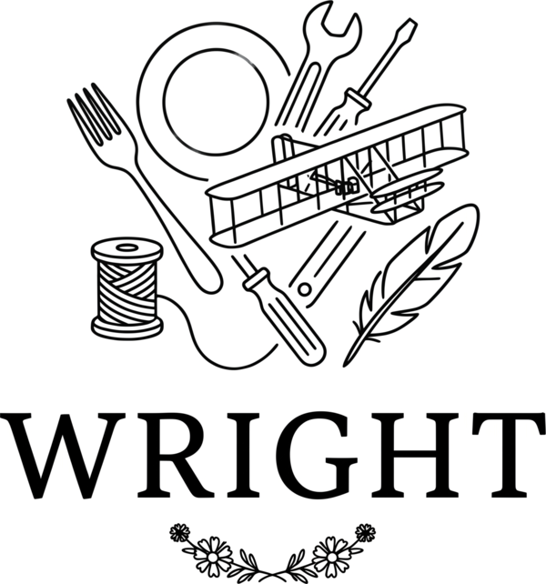
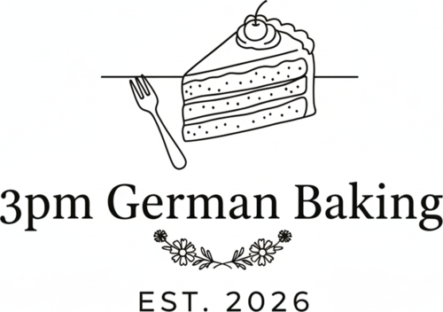

> **wright** /rīt/ — *noun*: a maker or builder. From Old English *wyrhta* (worker), as in *shipwright*, *wheelwright*, *playwright*. Here: a wright for your recipes, assemblies, and bills of materials.

<p align="center">
  <a href="https://wright.germanbakingasheville.com">
    
  </a>
</p>

Pure Python library for production planning, cost calculation, shopping list
generation, allergen detection, nutrition analysis, and supply tracking.

Data-source agnostic. No I/O inside the core — models are plain Pydantic, the
`PurchasedItem` protocol accepts anything. Subclass to add your own fields.

```bash
pip install wright
```

## Recipes and ingredients

```python
from wright import Recipe, Ingredient, RecipeComponent

cake = Recipe(
    name="Lemon Cake",
    components=[RecipeComponent(name="Batter", ingredients=[
        Ingredient(name="Flour", quantity=300, unit="g"),
        Ingredient(name="Butter", quantity=200, unit="g"),
    ])],
    prep_time=30, cook_time=45,
    servings=12,
)

double = cake * 2   # scale a recipe with *
```

## Beyond food — Material and Component

`Material` and `Component` are the domain-agnostic base classes behind
`Ingredient` and `RecipeComponent`.  Use them directly for non-food domains:

```python
from wright import Material, Component

# Construction: a deck's bill of materials
framing = Component(name="Deck Framing", materials=[
    Material(name="2x6 Pressure-Treated", quantity=24, unit="ft", require_tags=["#2"]),
    Material(name="3\" Deck Screws", quantity=200, unit="each"),
])
footings = Component(name="Footings", materials=[
    Material(name="Concrete Mix", quantity=6, unit="bag", equivalent_quantity=60, equivalent_unit="lb"),
])
```

Same `scale()`, `__mul__`, and supply list pipeline works across all domains.

## Costing

```python
from decimal import Decimal
from wright import Purchase, calculate_recipe_cost

groceries = [
    Purchase(name="Flour", quantity=1000, unit="g", price=Decimal("3.99")),
    Purchase(name="Butter", quantity=500, unit="g", price=Decimal("5.49")),
]

cost = calculate_recipe_cost(cake, groceries)
print(cost.cost_per_serving_range.midpoint)
```

## Planning a production run

```python
from datetime import date
from wright import ProductionRun, ProductionItem, generate_shopping_list

session = ProductionRun(
    date=date(2026, 6, 20),
    production=[ProductionItem(recipe="Lemon Cake", quantity=3)],
    target_dates=[date(2026, 6, 20)],
)

shopping = generate_shopping_list(session, {"Lemon Cake": cake})
```

[Full grocery list example](https://github.com/3pm-baking/wright/blob/9f4b0d1/examples/grocery_list.py)
— grouped by store aisle with costs.

## Allergens, nutrition, supply, pricing

```python
from wright import detect_dietary_properties, calculate_recipe_macros
from wright import Stock, SupplyItem
from wright import margin_price

badges = detect_dietary_properties(cake)
macros = calculate_recipe_macros(cake, nutrition_registry=registry)
stock = Stock([SupplyItem(name="Flour", quantity=2000, unit="g")])
price = margin_price(Decimal("2.00"), 0.67)
```

## Design

- **No I/O.** Functions take data in, return data out.
- **Protocol-based.** `PurchasedItem` accepts any class with the right attributes.
- **Pluggable.** Every decision point accepts an injection.
- **Subclass-friendly.** `Material` / `Ingredient` inheritance chain lets you
  add domain fields (construction grades, food vendor info) without monkey-patching.
- **Multi-domain.** Same pipeline for cookies, decks, beer recipes, or assembly
  lines — just swap the model subclass and category rules.

## Requirements

Python 3.11+. Dependencies: `pydantic>=2.8.2`, `pint>=0.25`, `pyyaml>=6.0.3`.

## License

MIT. See [LICENSE](https://github.com/3pm-baking/wright/blob/main/LICENSE).

<br>

<p align="center">
  
</p>
<p align="center">
  <a href="https://github.com/3pm-baking/wright">wright</a> is created and maintained by
  <a href="https://germanbakingasheville.com">3pm German Baking, LLC</a>
  a farmers market bakery in Asheville, NC.
</p>
